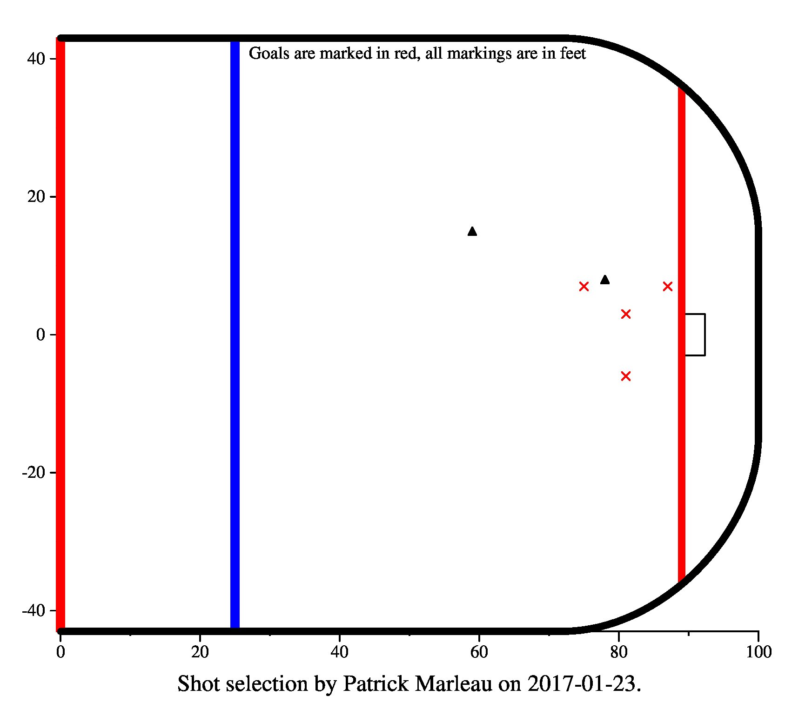

# NHL shot selection visualizer
### This project is meant to help visualize NHL shot selection for an individual player in an individual game
### Written for Dr. James Plank's Advanced Programming and Algorithms class fall 2021

I'm a big hockey fan (Go Blues!) so I figured I would make a little shot visualization tool for the jgraph assignment.

I've chosen to write this in Python because of my familiarity with it and easy access to a web requests api, and simple packages to parse the JSON that is returned by the NHL API.

Written in python 3.8.10 but should work for any python 3 version. The only external library I require is requests. Use pip to install it like so:

`python -m pip install requests`

To generate the jgraph input, run

`python main.py [yyyy-mm-dd] "[player full name]"`

for example:

`python main.py 2019-06-12 "Ryan O'Reilly"`

Depending on your python config, you might have to use `python3` in place of `python` in these commands. Whatever actually runs python 3 on your system. The makefile assumes it's python3 so you'll have to edit the PYTHON variable on line 1 of the makefile that if that's not the case.

By default, the makefile will generate a few example files and dump them into the makefile-output folder.

You can also use the makefile to generate an output pdf like so:

`make custom DATE=[yyyy-mm-dd] PLAYER="[player full name]"`

for example:

`make custom DATE=2019-06-12 PLAYER="Ryan O'Reilly"`

The makefile requires ps2pdf to be installed. If there is no jgraph executable in the root directory of the repo then it will compile one and place it there.

Here are the example graphs generated by running make:

The second longest NHL game ever, May 24th 2021. Winnipeg's Kyle Connor had only 4 shots out of his team's 43, but one of them was the 3OT winner 106 minutes into the game

San Jose's Patrick Marleau scored 4 goals, each in the third period on January 23, 2017. Tied for most goals in one period ever.

Washington's Alex Ovechkin with 0 goals on 15 shots. This is the highest all time shot total I could find that had coordinate data (all the other ones were too old). Unfortunate that he couldn't find the back of the net in a 1-0 loss

Another Winnipeg one. Patrik Laine scored 5 goals on 5 shots against the St. Louis Blues. I was at this game, cheering for the Blues. Not a fun time

My favorite of the bunch. Alex Pietrangelo's game winning goal in game 7 of the Stanley Cup Final to clinch the series and the first championship in St. Louis Blues 51-year history.

Here is a quick list of some functionality I would have liked to have added if I had more time
- Making the playing space look more like a real hockey rink
- Game ranges rather than just one game. Players generally only have a few shots in a game so the graphs aren't as intersting as I thought they would be
- Shot density visualization, such as [here](http://www.stat.cmu.edu/cmsac/poster2020/posters/Kumagai-ClusteringNHLShot.pdf). Not sure if this is even possible with JGraph but seems like it could make for an interesting exercise.
- Adding captions under the goals that say when they were scored and who assisted.

known possible problems:
- If more than one player who plays on a given day have the same name, there is no way to specify the correct one so it won't always work. As far as I know, there are no two active players who have the same name but it's possible.
- I'm not sure how far back the shot data goes. If there are no coordinates in the data then there will be an error
